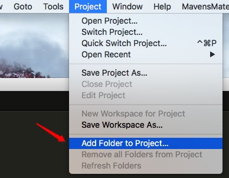
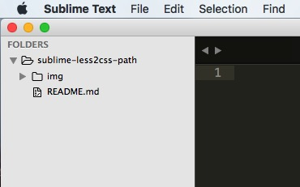
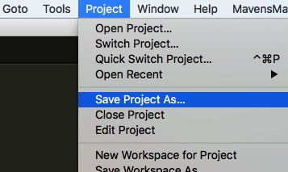
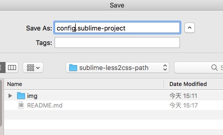
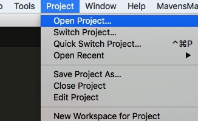
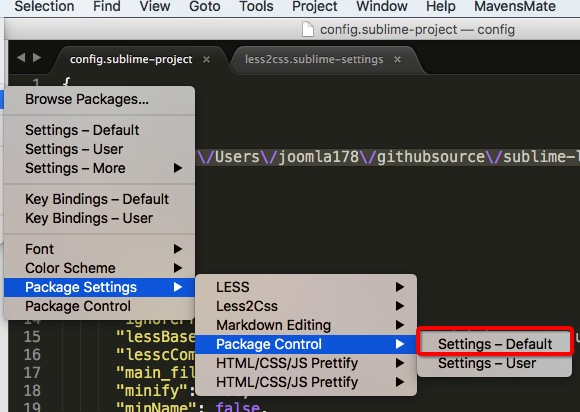

关于sublime中的Less2css输出css路径的配置
===

我们知道sublime Text是一款前端最轻便的强大编辑器，作为预编译工具中的Less自然不能缺席Sublime，less2css这款插件也是编译less的最好插件之一，它默认less和它产出的css会在同一个目录，但在项目管理中就显得麻烦了，所以我们要配置less和css的相对目录。

插件的安装就不多赘述了！而且相信大家也试过修改setting配置文件去改变"outputDir": "./",的值，但是编译生成的css会莫名地出现在别的什么目录下，原因官方说明了编译输出的目录必须为绝对路径，打个比方，这个文件在 D:/sublime-less2css-path/css/，但是不可能每个项目都这样操作。

下面我们就从官方说明文档着手改起来

## 1. 配置保存项目

sublime有项目的概念，所以一旦有了项目的概念，那么less和css的路径就可以参照这个项目来配置

如下图，将我们的项目文件夹添加到sulime的project中



于是很平常的出现了左侧的FOLDERS树结构



这时候只是临时配置了这个项目，如果彻底退出sublime的话，这个项目就得重新加载进来，所以我们要把这个项目存起来，点击Project - Save Porject As...



弹出保存窗口，选择一个你认为比较保险的目录来保存后缀名为 .sublime-project的配置文件，姑且我们就存在当前项目下命名为config.sublime-project，如下图



这样我们的项目就保存成功了，再次打开项目的时候，可以选择Project - Open project就可以了



## 2. 修改项目配置

上述保存的config.sublime-project文件就是管理整个项目的路径、插件的配置，优先级高于插件的Settings-User和Settings-Default，这个配置文件插件作者给了足够的说明：

访问 https://github.com/timdouglas/sublime-less2css 最底部Project settings

我们使用sublime打开文件config.sublime-project，添加以下代码：

```javascript
{
  "folders":[{
    "path": "\/Users\/joomla178\/githubsource\/sublime-less2css-path"
  }],
  "settings":{
    "less2css":{
      "lessBaseDir": "\/Users\/joomla178\/githubsource\/sublime-less2css-path\/less",
      "outputDir": "\/Users\/joomla178\/githubsource\/sublime-less2css-path\/css",
    }
  }
}
```

分析一下上述代码：

第一段folders是配置项目文件夹所在路径，因为配置文件是json，所以路径中的斜杠"/"要使用"\/"进行转义，那在Windows目录下例如"D:\file"的表达就应该是 "D:\\file"

第二段代码的settings,less2css都是默认配置，下面的lessBaseDir和outputDir是来自配置文件Packages Settings - Less2Css - Settings - Default的代码截取



当然，如果你希望把其它的配置项目加进来也行，比如自动编译"autoCompile": ture之类的，换句话说，上述项目配置只适应于本项目，此外，还可以对快捷键的配置进行绑定到项目配置中。

*注意以上演示目录在你的计算机上要变更为你的文件绝对目录
